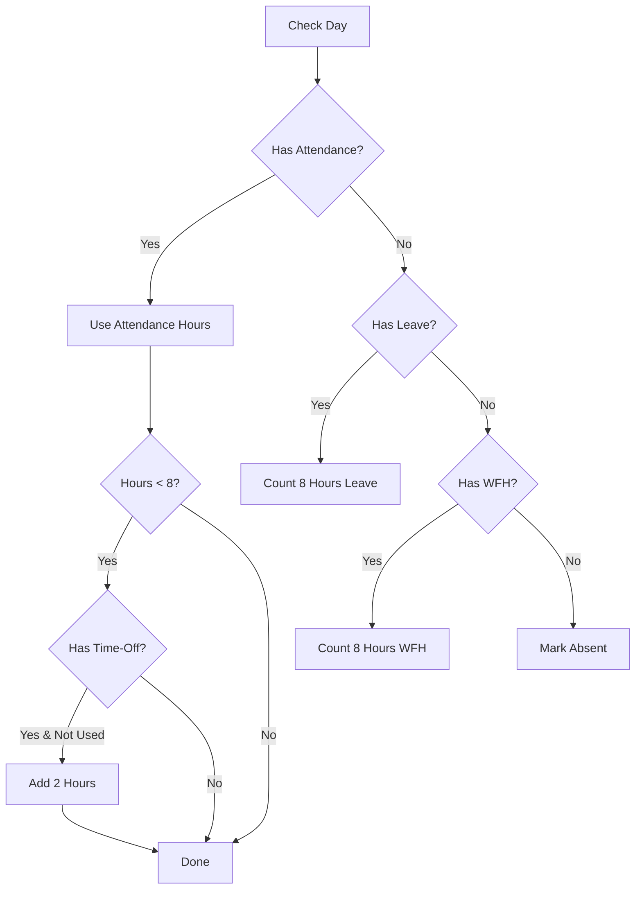

# Monthly Work Reports Implementation Walkthrough

## Summary

Successfully implemented two new reports for the HR system:

1. **Monthly Work Summary Report** - Shows total work hours per employee for a selected month
2. **Monthly Work Details Report** - Shows day-by-day breakdown for a specific employee

## Backend Changes

### New DTOs
Created [MonthlyWorkReportDtos.cs](file:///d:/hr/hr/backend/HrSystem.Application/DTOs/Reports/MonthlyWorkReportDtos.cs):
- `MonthlyWorkSummaryDto` - Summary for each employee (hours, days present/leave/WFH/absent)
- `DailyWorkDetailDto` - Daily detail (date, status, check-in/out, hours)
- `MonthlyWorkDetailsDto` - Full monthly details with daily breakdown and totals

### Service Layer Updates
Updated [IReportService.cs](file:///d:/hr/hr/backend/HrSystem.Application/Services/Reports/IReportService.cs):
- Added `GetMonthlyWorkSummaryReportAsync` method signature
- Added `GetMonthlyWorkDetailsReportAsync` method signature

Updated [ReportService.cs](file:///d:/hr/hr/backend/HrSystem.Application/Services/Reports/ReportService.cs):
- Implemented business logic for calculating work hours from:
  - `AttendanceLog` - Primary source for work hours
  - `LeaveRequest` (approved) - Counts as 8 hours
  - `WorkFromHomeRequest` (approved) - Counts as 8 hours
  - `TimeOffRequest` (approved) - Adds 2 hours if attendance < 8 hours (once per month)
- Weekend detection: Friday & Saturday are weekends
- Helper methods: `IsWeekend()`, `GetWorkingDaysInMonth()`

### API Endpoints
Updated [ReportsController.cs](file:///d:/hr/hr/backend/HrSystem.Api/Controllers/ReportsController.cs):

| Endpoint | Method | Description |
|----------|--------|-------------|
| `/api/Reports/monthly-work-summary` | GET | Get summary for all employees with filters |
| `/api/Reports/monthly-work-details/{employeeId}` | GET | Get daily details for specific employee |

**Query Parameters:**
- `year` (required) - Year for the report
- `month` (required) - Month (1-12)
- `departmentId` (optional) - Filter by department
- `employeeId` (optional) - Filter by employee (summary only)

---

## Frontend Changes

### Service Updates
Updated [report.service.ts](file:///d:/hr/hr/frontend/src/app/core/services/report.service.ts):
- `getMonthlyWorkSummaryReport(year, month, departmentId?, employeeId?)`
- `getMonthlyWorkDetailsReport(employeeId, year, month)`

### Report Viewer Updates
Updated [report-viewer.component.html](file:///d:/hr/hr/frontend/src/app/features/reports/report-viewer/report-viewer.component.html):
- Added "Monthly Work Summary" option
- Added "Monthly Work Details" option

Updated [report-viewer.component.ts](file:///d:/hr/hr/frontend/src/app/features/reports/report-viewer/report-viewer.component.ts):
- Added switch cases for new report types
- Special handling for details report (extracts `dailyDetails` array)
- Validation for required employee selection in details report

### Filter Updates
Updated [report-filters.component.html](file:///d:/hr/hr/frontend/src/app/features/reports/report-filters/report-filters.component.html):
- Year/Month selectors for monthly reports
- Date range for other reports
- Employee required indicator for details report

Updated [report-filters.component.ts](file:///d:/hr/hr/frontend/src/app/features/reports/report-filters/report-filters.component.ts):
- `selectedYear` and `selectedMonth` properties
- `isMonthlyReport()` computed signal
- `isDetailsReport()` computed signal
- Updated `applyFilters()` to include year/month

---

## Business Logic

### Work Hours Calculation

For each **working day** (excludes Friday & Saturday):

### Constants (Future Settings)
- Standard work day: **8 hours**
- Time-off request: **2 hours** (once per month per employee)
- Weekends: **Friday & Saturday**

---

## Verification

- ✅ Backend builds successfully
- ✅ Frontend builds successfully
- API endpoints ready for testing at:
  - `GET /api/Reports/monthly-work-summary?year=2026&month=1`
  - `GET /api/Reports/monthly-work-details/{employeeId}?year=2026&month=1`
